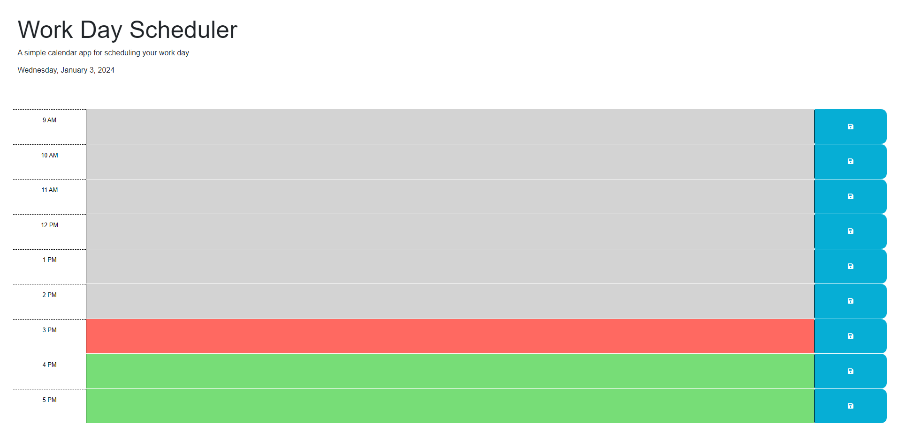
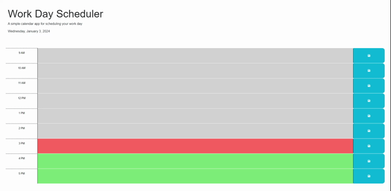

# Work Day Scheduler

## Description

The Work Day Scheduler application was designed to schedule different items in the current day between the word day hours of 9 AM to 5 PM. 

## Installation

N/A

## Usage

Work Day Scheduler Link: https://itzelherndz.github.io/work-day-schedule/

The user can use this webpage to schedule their work day. Upon entering the webpage it will look like the following figure. This figure was taken at approximately 3:50 PM on January 3rd, 2024.

As seen on the above figure, the time blocks that are in the past are shaded in gray, the time block that is in the present is shaded in red, and the time blocks that are in the future are shaded in green.

When the user clicks on an text area, the user can fill it out with the event(s) of the corresponding time. The event will not be saved unless the user clicks the corresponding save button. Once saved the data will be stored in local storage. If the user decides to refresh the page, the data will still be there. This is demonstrated in the following figure.

## Credits

Rapstine, X (2022) Work Day Scheduler Starter Code [Source Code]. https://github.com/coding-boot-camp/crispy-octo-meme

## License

Please refer to the LICENSE file in the repository.